<div align="center">



**一个面向个人的跨设备消息同步与整理工具**

[](./LICENSE)
[](https://nextjs.org/)
[](https://www.typescriptlang.org/)
[](https://supabase.com/)

</div>

---

## 项目简介

Echo 灵感来自“给自己发消息”这个最朴素的需求：跨设备传文字，比任何 App 都快，比随手粘贴在备忘录里更有条理。

它适合用来：

- 在电脑和手机之间快速同步文本片段
- 把临时信息先收进一个统一入口，之后再整理
- 通过文件夹和标签逐步分类内容
- 用自动标签做轻量的规则型分类

> 项目现状：核心功能已可用，持续迭代中。欢迎试用、提 issue、或直接参与开发。Roadmap 见文末。

---

## 功能特性

### 核心功能

- 跨设备实时同步：Supabase Realtime 驱动，轮询兜底
- 文件夹管理：创建、切换、删除，默认收件箱
- 标签系统：创建、筛选、删除，支持一条消息多标签
- 自动标签：基于规则，发送即分类
- 消息删除：软删除实现，便于后续扩展撤销 / 归档
- 消息编辑：编辑后自动刷新自动标签
- 全文搜索：优先使用 PostgreSQL FTS，旧表结构自动降级为前端匹配
- 消息列表：自动滚动到底部，体验接近 IM

### 当前内置自动标签规则

| 标签 | 触发条件 |
| --- | --- |
| `链接` | 含 URL |
| `待办` | 含任务关键词 |
| `代码` | 含代码块或关键字 |
| `清单` | 含列表结构 |
| `长文` | 超过字数阈值 |
| `电话` | 含电话号码格式 |

---

## 技术栈

| 层级 | 技术 |
| --- | --- |
| 框架 | Next.js 16 |
| UI | React 19 + Tailwind CSS 4 |
| 语言 | TypeScript |
| 后端 / 实时同步 | Supabase (Database + Realtime) |

---

## 自己部署

> 本仓库不包含任何数据库凭据，你需要使用自己的 Supabase 项目。

### 第一步：克隆仓库

```bash
git clone https://github.com/<your-name>/echo-app.git
cd echo-app
```

### 第二步：安装依赖

```bash
npm install
```

### 第三步：创建 Supabase 项目

1. 打开 [supabase.com](https://supabase.com/)
2. 新建项目
3. 等待数据库初始化完成

### 第四步：初始化数据库

打开 Supabase 后台的 `SQL Editor`，粘贴并执行 [`supabase/schema.sql`](./supabase/schema.sql)。

执行后会自动创建：

- `notes`
- `folders`
- `tags`
- `note_tags`

还会顺手完成：

- 为 `notes` 增加 `folder_id`
- 为 `notes` 增加 `updated_at`
- 为 `notes` 增加 `deleted_at`
- 为 `notes` 增加全文搜索向量列 `fts`
- 为软删除和全文搜索创建索引
- 创建默认文件夹 `收件箱`
- 配置 RLS 策略
- 将相关表加入 `supabase_realtime`

### 第五步：配置环境变量

```bash
cp .env.example .env.local
```

在 Supabase 后台 `Project Settings -> API` 找到以下两个值，填入 `.env.local`：

```env
NEXT_PUBLIC_SUPABASE_URL=your_supabase_project_url
NEXT_PUBLIC_SUPABASE_ANON_KEY=your_supabase_anon_key
```

### 第六步：本地启动

```bash
npm run dev
```

访问 `http://localhost:3000`。

如果你要在同一局域网下让手机访问：

- 电脑访问：`http://localhost:3000`
- 手机访问：`http://你的电脑IP:3000`

---

## 部署到线上

推荐 [Vercel](https://vercel.com/)：

1. 将代码推送到你自己的 GitHub 仓库
2. 在 Vercel 导入该仓库
3. 在项目环境变量中填写：
   - `NEXT_PUBLIC_SUPABASE_URL`
   - `NEXT_PUBLIC_SUPABASE_ANON_KEY`
4. 点击部署

部署后电脑和手机均可直接访问，无需本地持续开机。

其他可选平台：

- Railway
- Render
- 自己的服务器

---

## 数据结构

采用可扩展的多表结构，为后续功能预留空间：

```text
notes       → 消息主体
folders     → 文件夹
tags        → 标签
note_tags   → 消息与标签的多对多关系
```

---

## 本地开发命令

```bash
npm run dev
npm run build
npm run start
npm run lint
```

---

## 安全说明

- `.env.local` 已被 `.gitignore` 忽略，不会提交到 GitHub
- 仓库中只保留 `.env.example` 作为模板
- `NEXT_PUBLIC_SUPABASE_ANON_KEY` 虽是前端可见变量，仍属于你自己的 Supabase 项目入口，请勿将真实值提交到公开仓库
- 每位使用者应创建自己独立的 Supabase 项目，互不干扰

---

## 常见问题

**Q：启动后一直加载中？**  
常见原因：`.env.local` 未填写、Supabase SQL 未执行、表结构未初始化、Realtime 未接通。

**Q：自动标签是 AI 吗？**  
当前版本是规则型分类，优点是简单、透明、无需额外 API Key。AI 分类在 Roadmap 中。

**Q：搜索已经能用了吗？**  
可以。执行最新的 `supabase/schema.sql` 后会启用 PostgreSQL 全文搜索；如果你的表结构还没升级，前端也会自动降级为基础内容匹配。

**Q：能用作者的 Supabase 吗？**  
不能，也不应该。开源的目的是让你用自己的数据库跑自己的数据。

**Q：`.env.local` 在哪里？**  
仓库里只有 `.env.example`，你需要自行 `cp .env.example .env.local` 并填入自己的变量。

---

## Roadmap

- [x] 删除消息（已实现）
- [x] 全文搜索（已实现）
- [ ] 收藏 / 归档
- [ ] 自动标签规则可配置
- [ ] PWA 安装体验
- [ ] AI 自动分类
- [ ] AI 自动摘要
- [ ] 更完善的移动端体验

---

## 贡献

欢迎提 issue、提建议、提 PR。

特别欢迎以下方向的贡献：

- 搜索与筛选增强
- 自动标签规则设计
- 移动端体验优化
- PWA / 部署体验改进

---

## License

[MIT](./LICENSE)
